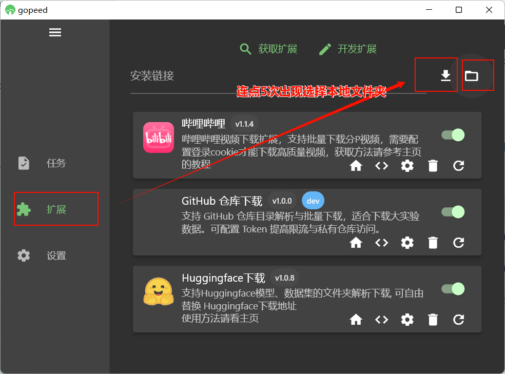

# gopeed-extension-github

[简体中文](README.md) | [English](readme/README.en.md)

GoPeed 的 GitHub 仓库下载扩展，支持解析仓库目录并批量下载文件，适合下载大实验数据、数据集等。

本人就是因为想直接 `git clone` 一个 GB 级别的数据集仓库太慢，才做了这个扩展：用 GoPeed 按目录解析、多任务并发下载，比整仓 clone 更稳、也更容易断点续传。本扩展由 AI 在 [gopeed-extension-huggingface](https://github.com/DSYZayn/gopeed-extension-huggingface) 的基础上改出，结构类似，只是把解析目标从 Hugging Face 换成了 GitHub API。

## 功能

- 支持 **仓库根目录**、**指定分支/标签下的子目录** 解析
- 支持 **单文件**（blob 链接）直接下载
- 根目录使用 Git Tree API 一次获取整棵文件树，子目录使用 Contents API 递归
- 可选配置 **GitHub Token**：提高 API 限流（5000 次/小时）、访问私有仓库

## 安装

在 GoPeed 扩展页输入本仓库的 clone 地址安装，例如：

```
https://github.com/DSYZayn/gopeed-extension-github
```

或使用开发者模式：扩展页连续点击安装按钮 5 次，选择本地项目目录，如图。



---

## 使用

满足以下格式的链接即可 **解析该目录下所有文件**（或单文件）。

### 支持的链接格式

| 场景       | URL 格式                                                 | 说明                            |
| ---------- | -------------------------------------------------------- | ------------------------------- |
| 仓库根目录 | `https://github.com/<owner>/<repo>/tree/<branch>`        | 必须带 `tree/<分支名>`          |
| 子目录     | `https://github.com/<owner>/<repo>/tree/<branch>/<path>` | `<path>` 为仓库内路径           |
| 单文件     | `https://github.com/<owner>/<repo>/blob/<branch>/<path>` | 必须带 `blob/<分支名>/文件路径` |

- **owner**：用户名或组织名
- **repo**：仓库名
- **branch**：分支名，如 `main`、`master`
- **path**：仓库内路径，根目录可不填

### 重要：地址栏要带 `tree/<分支>`

在浏览器里打开仓库时，地址栏往往是 **没有** `tree/main` 的，例如：

- 你看到的：`https://github.com/wmt-conference/wmt25-terminology`
- 本扩展需要：`https://github.com/wmt-conference/wmt25-terminology/tree/main`

**请手动在仓库地址后加上 `/tree/main`**（或 `/tree/你的分支名`），才能按「目录」解析并列出所有文件。若只填 `https://github.com/owner/repo`，扩展会按根目录请求，但 GitHub API 对根目录的返回方式不同，建议**始终带上 `/tree/main`** 再粘贴到 GoPeed。

单文件下载同理：需使用带 **`blob/<分支>/路径`** 的链接（在 GitHub 页面点进文件后，地址栏就是这种格式）。

---

### 获取 GitHub Token（推荐）

未配置 Token 时，同一 IP 的匿名请求每小时约 **60 次**，超出会报 **403 API rate limit exceeded**，解析失败。配置 Token 后约 **5000 次/小时**，且可访问私有仓库。Token 用于 **HTTPS / API**，不是 SSH 用的（SSH 用本机密钥）。

**步骤：**

1. 打开 [GitHub → Settings → Developer settings → Personal access tokens](https://github.com/settings/tokens)（或直接访问 <https://github.com/settings/tokens>）。
2. 点击 **Generate new token** → 选择 **Generate new token (classic)**。
3. 填写 Note（如 `GoPeed 扩展`），勾选权限 **repo**（访问仓库内容）；若只下公开仓库可只勾选 **public_repo**。
4. 生成后**复制** token（只显示一次，请妥善保存）。
5. 在 GoPeed 中打开 **扩展** → 找到「GitHub 仓库下载」→ **设置** → 在 **GitHub Token** 一栏粘贴并保存。

---

### 范例

1. 下载 `wmt-conference/wmt25-terminology` 根目录下所有文件：  
   `https://github.com/wmt-conference/wmt25-terminology/tree/main`

2. 下载该仓库的 `ranking` 目录：  
   `https://github.com/wmt-conference/wmt25-terminology/tree/main/ranking`

3. 下载单文件 `README.md`：  
   `https://github.com/wmt-conference/wmt25-terminology/blob/main/README.md`

---

## 开发

1. **图标**：将 `icon.png`（建议 128×128）放入 `assets/` 目录，或从 `gopeed-extension-huggingface/assets/icon.png` 复制。
2. 构建与调试：

```bash
npm install
npm run dev   # 监听构建，配合 GoPeed 开发者模式调试
npm run build # 生产构建
```

---

## 说明

- 大文件（>100MB）若使用 Git LFS，当前版本按普通文件处理，可能得到 LFS 指针文件而非真实内容；后续可扩展 LFS 支持。
- 扩展仅支持 `github.com`、`www.github.com` 的仓库链接。

### 排查「只看到一个 main」或「API 限流」

1. **确认是本扩展在处理**：解析后任务名应为 **「GitHub: 仓库名」**。若任务名是「Error: API 限流，请在扩展设置中配置 GitHub Token」，说明已触发 GitHub 限流，请按上文配置 Token。
2. **确认链接带 `tree/<分支>`**：根目录或子目录链接需包含 `tree/main`（或对应分支名）。
3. **看扩展日志**：GoPeed 安装目录下 `logs/extension.log` 中有 `[GitHub 扩展] 收到 URL:` 和 `[GitHub Parser]` 的错误信息，可确认是否命中本扩展以及是否有 API 报错。
4. **禁用其他 GitHub 扩展**：若有其他扩展也匹配 `*://github.com/*`，可能抢先返回结果，请暂时只保留本扩展再试。

---

## License

ISC
