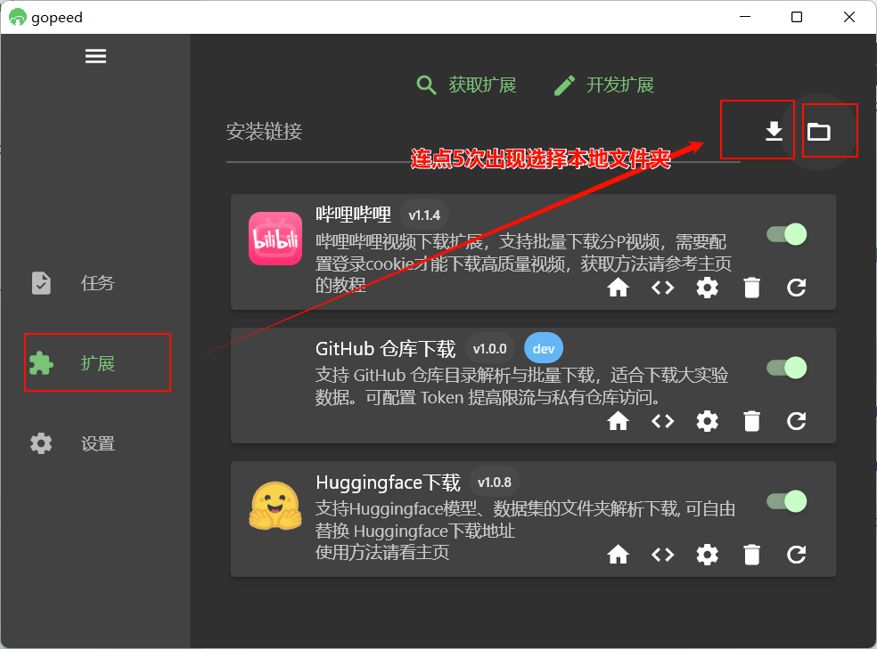

# gopeed-extension-github

[简体中文](README.md) | [English](readme/README.en.md)

Gopeed 的 GitHub 仓库下载扩展，支持解析仓库目录并批量下载文件，适合下载大实验数据、数据集等。

本人就是因为想直接 `git clone` 一个 GB 级别的数据集仓库太慢，才做了这个扩展：用 Gopeed 按目录解析、多任务并发下载，比整仓 clone 更稳、也更容易断点续传。本扩展在 [gopeed-extension-huggingface](https://github.com/DSYZayn/gopeed-extension-huggingface) 的基础上改出，结构类似，把解析目标从 Hugging Face 换成了 GitHub API，并支持了对 git lfs 的解析。

## 功能

- 支持 **仓库根目录**、**指定分支/标签下的子目录** 解析
- 支持 **单文件**（blob 链接）直接下载
- 支持 **Releases** 资产、**Archive** 打包（zip/tar.gz）、**Gist** 与 **raw.githubusercontent.com** 直链
- 可选 **下载代理**：仅包装最终下载 URL，不代理 GitHub API；前缀由用户自行配置（可参考 [ghproxy.link](https://ghproxy.link/)）
- **Git LFS**：自动识别 LFS 指针文件并解析为真实大文件下载地址（已适配 GitHub Batch API，公开仓库无需 Token 即可拉取 LFS）；列表中显示 LFS 真实文件大小（而非指针文件大小）
- **元数据**：根目录与子目录均通过 Git Tree API（`commits` + `git/trees`）获取文件树，再按仓库内路径过滤；若单次响应被截断（`truncated`），会按 GitHub 建议改为非递归并逐子树补全
- **分支名含 `/`**：例如 `feature/foo`，请使用浏览器地址栏中的完整 `tree/...` 链接，扩展会通过 GitHub API 解析 ref 与路径
- 可选配置 **GitHub Token**：提高 API 限流（5000 次/小时）、访问私有仓库及私有 LFS

## 安装

在 Gopeed 扩展页输入本仓库的 clone 地址安装，例如：

```
https://github.com/holyguacamoleCoder/gopeed-extension-github
```

或使用开发者模式：扩展页连续点击安装按钮 5 次，选择本地项目目录，如图。



---

## 使用

满足以下格式的链接即可 **解析该目录下所有文件**（或单文件）。

### 支持的链接格式

| 场景       | URL 格式                                                 | 说明                            |
| ---------- | -------------------------------------------------------- | ------------------------------- |
| 仓库根目录 | `https://github.com/<owner>/<repo>/tree/<branch>`        | 必须带 `tree/<分支名>`；也可只填 `.../<owner>/<repo>`，扩展会**默认按 `main` 分支**解析 |
| 子目录     | `https://github.com/<owner>/<repo>/tree/<branch>/<path>` | `<path>` 为仓库内路径           |
| 单文件     | `https://github.com/<owner>/<repo>/blob/<branch>/<path>` | 必须带 `blob/<分支名>/文件路径` |
| Releases   | `https://github.com/<owner>/<repo>/releases`             | 最新 Release 的全部资产         |
| 指定 Release | `https://github.com/<owner>/<repo>/releases/tag/<tag>` | 指定 tag 的资产；`.../releases/expanded_assets/<tag>` 同样支持 |
| Archive    | `https://github.com/<owner>/<repo>/archive/refs/heads/main.zip` | 仓库打包为单文件下载      |
| Gist       | `https://gist.github.com/<user>/<gist_id>`               | 列出 Gist 内全部文件            |
| raw 直链   | `https://raw.githubusercontent.com/<owner>/<repo>/<ref>/<path>` | 单文件下载              |

- **owner**：用户名或组织名
- **repo**：仓库名
- **branch**：分支名或标签，如 `main`、`v1.0`；若分支名本身含斜杠（如 `njpm/tsdb-utf8-mixed-querying`），请直接复制 GitHub 页面上的完整 `tree/...` 地址
- **path**：仓库内路径，根目录可不填

### 不支持的页面

以下 **不会** 解析为下载任务，请改用上表中的链接格式：

- Issues、Pull requests、Discussions、Actions、Projects、Wiki、Security、Insights
- Compare、Commits（列表页）等

### 重要：`tree/<分支>` 可省略（默认 main）

在浏览器里打开仓库时，地址栏往往是 **没有** `tree/main` 的，例如：

- 你看到的：`https://github.com/wmt-conference/wmt25-terminology`
- 等价解析：`https://github.com/wmt-conference/wmt25-terminology/tree/main`

**若只粘贴 `https://github.com/owner/repo`（无 `tree`），扩展会自动按 `main` 分支解析目录。** 若默认分支不是 `main`，请手动改为 `/tree/你的分支名`。

单文件下载需使用带 **`blob/<分支>/路径`** 的链接（在 GitHub 页面点进文件后，地址栏就是这种格式）。

路径会经规范化处理（合并重复斜杠、去掉空段），`.../tree/main` 与 `.../tree/main/` 通常等价。

---

### 获取 GitHub Token（推荐）

未配置 Token 时，同一 IP 的匿名请求每小时约 **60 次**，超出会报 **403 API rate limit exceeded**，解析失败。配置 Token 后约 **5000 次/小时**，且可访问私有仓库。Token 用于 **HTTPS / API**，不是 SSH 用的（SSH 用本机密钥）。

**步骤：**

1. 打开 [GitHub → Settings → Developer settings → Personal access tokens](https://github.com/settings/tokens)（或直接访问 <https://github.com/settings/tokens>）。
2. 点击 **Generate new token** → 选择 **Generate new token (classic)**。
3. 填写 Note（如 `Gopeed 扩展`），勾选权限 **repo**（访问仓库内容）；若只下公开仓库可只勾选 **public_repo**。
4. 生成后**复制** token（只显示一次，请妥善保存）。
5. 在 Gopeed 中打开 **扩展** → 找到「GitHub 仓库下载」→ **设置** → 在 **GitHub Token** 一栏粘贴并保存。

### 下载代理（可选）

在扩展设置中可开启 **启用下载代理**，并在 **代理前缀** 填写可用代理地址（需以 `/` 结尾；地址可参考 [ghproxy.link](https://ghproxy.link/)）。开启后，最终下载 URL（raw、LFS、Release 资产、Archive、Gist）会加上代理前缀，**GitHub API 请求不走代理**。

- 适合国内访问 GitHub 较慢的场景
- 第三方代理服务请自行评估可信度；私有仓库与 LFS 大文件若代理失败，可关闭代理后重试

---

### 范例

1. 下载 `wmt-conference/wmt25-terminology` 根目录下所有文件：  
   `https://github.com/wmt-conference/wmt25-terminology/tree/main`

2. 下载该仓库的 `ranking` 目录：  
   `https://github.com/wmt-conference/wmt25-terminology/tree/main/ranking`

3. 下载单文件 `README.md`：  
   `https://github.com/wmt-conference/wmt25-terminology/blob/main/README.md`

4. 含 **Git LFS** 的仓库（会解析为真实大文件下载）：  
   `https://github.com/Zhangyanshen/lfs-test/tree/master`

5. 下载 Release 资产：  
   `https://github.com/GopeedLab/gopeed/releases`

6. 下载仓库 main 分支 zip：  
   `https://github.com/owner/repo/archive/refs/heads/main.zip`

### 快速测试链接（Archive / Gist / Releases）

| 类型 | 可直接粘贴测试的 URL |
| ---- | -------------------- |
| Archive | `https://github.com/octocat/Hello-World/archive/refs/heads/master.zip` |
| Gist | `https://gist.github.com/af855a8c9af9c424038c9b7eccda27ca` |
| Releases（最新） | `https://github.com/GopeedLab/gopeed/releases` |
| Releases（指定 tag） | `https://github.com/GopeedLab/gopeed/releases/tag/v1.6.2` |

---

### 使用注意（文件很多 / 解析超时）

- **文件数量特别多**的仓库在解析阶段需要拉取整棵文件树的元数据，可能较慢或触发 Gopeed 解析超时。
- **建议**：尽量使用 `tree/<分支>/<子目录路径>` 缩小范围，而不是始终在仓库根目录解析；并配置 **Token** 以降低限流带来的失败。

---

## 说明

- **Git LFS**：扩展会对每个文件请求前 512 字节，若以 `version https://git-lfs.github.com/spec/v1` 开头则视为 LFS 指针，并用 GitHub LFS Batch API 换取真实下载地址。公开仓库的 LFS 无需 Token 即可下载；私有仓库 LFS 需配置 Token。若某 LFS 对象在服务器上不存在（例如仓库只提交了指针未 push 大文件），文件列表中会显示英文标签 **LFS: Object missing (LFS pointer only)**，任务名可能带 **(LFS unresolved)**。LFS 真实下载地址经代理时可能失败，可关闭代理重试。
- 支持 `github.com`、`raw.githubusercontent.com`、`gist.github.com`、`gist.githubusercontent.com`。
- 用户可见的错误提示与上述 LFS 标签为 **英文**（便于与 Gopeed 界面统一）。
- **API 限流**：若解析失败且提示 **API rate limit exceeded**，请按上文配置 GitHub Token 后重试。

---

## Star趋势

[](https://www.star-history.com/#holyguacamoleCoder/gopeed-extension-github&type=date&legend=top-left)
